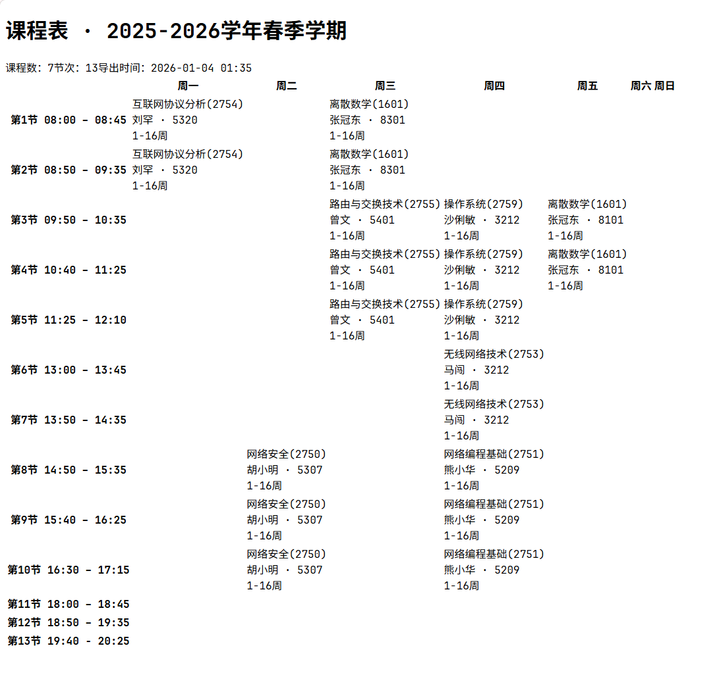

# SSPU Schedule Export

从学校教务系统页面导出静态 HTML 课表

## 1. 使用方式
1. 在浏览器中打开 oa办公 - 本专科教务 的“我的课表”页面
2. 按 F12 打开开发者工具，切换到 Console
3. 复制 src/sspu/export-html.js 中的全部代码
4. 粘贴到 Console，回车执行
5. 浏览器会自动下载一个无样式的 .html 文件（不涉及个人隐私）

## 2. 后续完成 pages
- [ ] 展示教程文档，给出复制代码
- [ ] 导入课表html文件，可选择css主题
- [ ] 生成一个短链接，数据被匿名存储在服务器侧，之后可通过该链接在任意设备浏览器中访问同一课表

> pages 仓库不公开，会声明：如用户自行导出或分享生成的课表文件，其内容与传播范围由用户自行控制，与本工具无关。

## 3. 碎碎念
2025.12.1 知校星球（之前已毕业学长做的微信小程序）运营不下去，下线了，了解到他们拿到同学课表和晨跑的方式也就是爬教务系统的数据，小程序层做好了数据隐私。没了它，现在课表和晨跑不能直接在上面看了，这太可惜了。 \
课程表 app 我之前一直用的 wakeup ，非常方便。它提供模板，把我本校的上课时间，课程表样式设置好，想也能一直用到毕业。但是！它年末加了开屏广告！app 也开始臃肿了，以前简洁的感觉没了。。 \
之前没发现，它也有从各教务系统手动导入的方式，可以省了我每学期要自己写课程信息的时间，但它也有日历显示问题，还是需要自设，不太完善。 \
我们学校就是用的树维教务，有了做这个工具的想法，vibe coding 启动！

> 想法来源： https://www.wakeup.fun/doc/shuwei.html