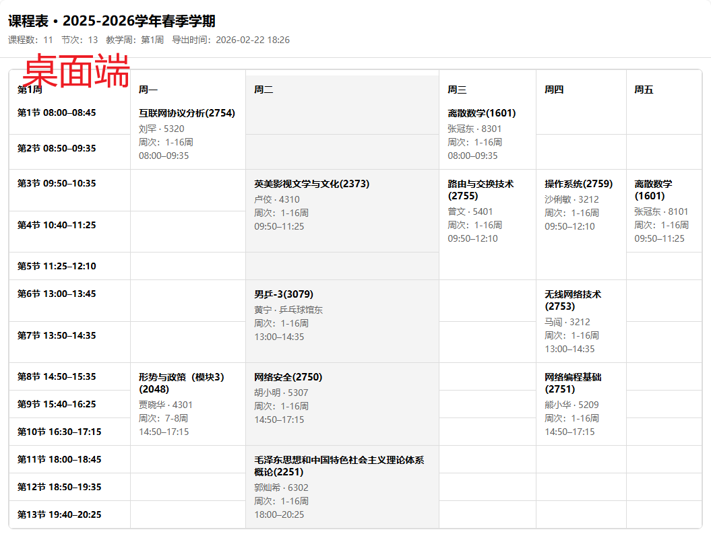

# SSPU-ScheduleExport

从学校教务系统页面导出静态 HTML 课表

## 一. 使用方式

1. 在浏览器中打开 oa办公 - 本专科教务 的“我的课表”页面
2. 按 F12 打开开发者工具，切换到 Console
3. 复制 `scripts/export-html.js` 中的全部代码
4. 粘贴到 Console，回车执行
5. 浏览器会自动下载一个无样式的 `schedule.html` 文件（不涉及个人隐私）


6. 将下载的 `schedule.html` 放入 `src/original/` （需要新建此文件夹）
7. 预览（本地样式渲染）：`npm run dev`，然后打开 http://localhost:3000/schedule
8. 生成带样式的静态 HTML：`npm run build:html`，输出到 `dist/schedule.html`，将这个静态保存或放服务器托管吧~



> 有需要自设的变量  
> 位于 `src/sspu/template-runtime.js` 顶部:  
>
> 1. `WEEK1_START`：第 1 周周一日期（北京时间），格式 `YYYY-MM-DD`  
> 2. `TERM_FINAL_WEEK`：期末周（最后一周）周次，例如 `17`

## 二. 开发

### 1. 已有功能

- 仅需导出原始 `schedule.html`，本地预览与构建会自动解析并渲染为移动端/桌面端双视图
- 导出时自动识别学年，学期，课程数，节次（eg. 2025-2026学年春季学期 课程数：11 节次：13）
- 动态显示北京时间，高亮今日（桌面端列 + 移动端当天卡片）
- 移动端加载后自动平滑滚动到当天
- 仅移动端按周过滤（桌面端表格保留全学期）
- 桌面端左上角显示“第X周”，移动端表头显示“第X周 周X”
- 未开学显示“未开学”，期末周结束后显示“已结课”

### 2. 自定义主题

当前内置主题是 `src/themes/midnight-ink.css`，整体特点：

- 黑白高对比、灰度为主的极简风格
- 表格与卡片边框清晰，信息层级靠字号与颜色区分
- 移动端为“按天列表”，桌面端为“表格视图”（`900px` 断点切换）

如何自定义主题？
1. 在 `src/themes/` 新建一个 `.css` 文件（建议全小写+连字符命名）。
2. 复制 `src/themes/midnight-ink.css` 作为起点，按需调整变量和样式。
3. 修改以下引用，让预览与构建使用你的主题：
   - `schedule/index.html` 中的 `<link rel="stylesheet" ...>`
   - `scripts/build-export.js` 中的 `themePath`
4. 运行：
   - 预览：`npm run dev`，打开 `http://localhost:3000/schedule`
   - 输出：`npm run build:html`（生成到 `dist/schedule.html`）

#### Prompt 模板（自定义主题）{修改处}
```
请在项目中按以下要求自定义主题。

目标：
- 基于 `src/themes/midnight-ink.css` 创建新主题：`src/themes/{theme-name}.css`
- 主题风格：{风格关键词，比如“暖色纸感/赛博蓝/复古报纸/日系清爽”等}
- 主要使用场景：课程表（桌面表格 + 移动端卡片）

具体设计要求：
- 主色：{主色}
- 辅色：{辅色}
- 背景：{背景描述，比如“有细微纹理/渐变/浅灰纸感”}
- 强调：{强调色或强调方式}
- 字体风格：{例如“清晰可读/轻微复古/无衬线”}
- 视觉层级：{比如“课程名最突出，地点次之，老师最弱”}

实现范围（必须覆盖）：
- CSS 变量（如有）
- 桌面表格：表头、当前日高亮、边框、空白单元格、课程单元格
- 移动端卡片：日期头、课程卡、时间/地点/老师字段、当前日高亮
- 断点与布局保持与原主题一致（`900px`）

工程修改：
1. 新建 `src/themes/{theme-name}.css`（复制 `src/themes/midnight-ink.css` 起步并改造）
2. 修改 `schedule/index.html` 的 `<link rel="stylesheet" ...>` 指向新主题
3. 修改 `scripts/build-export.js` 的 `themePath` 指向新主题

请直接给出修改后的文件内容或补丁，并说明改动的文件列表。

```

## 三. 碎碎念

2025.12.1 知校星球（之前已毕业学长做的微信小程序）运营不下去，下线了，了解到他们拿到同学课表和晨跑的方式也就是爬教务系统的数据，小程序层做好了数据隐私。没了它，现在课表和晨跑不能直接在上面看了，这太可惜了。  
课程表 app 我之前一直用的 wakeup ，非常方便。它提供模板，把我本校的上课时间，课程表样式设置好，想也能一直用到毕业。但是！它年末加了开屏广告！app 也开始臃肿了，以前简洁的感觉没了。。  
之前没发现，它也有从各教务系统手动导入的方式，可以省了我每学期要自己写课程信息的时间，但它也有日历显示问题，还是需要自设，不太完善。

> 想法来源： https://www.wakeup.fun/doc/shuwei.html  
> https://github.com/wtlyu/Course-Table-ICS-Formatter
